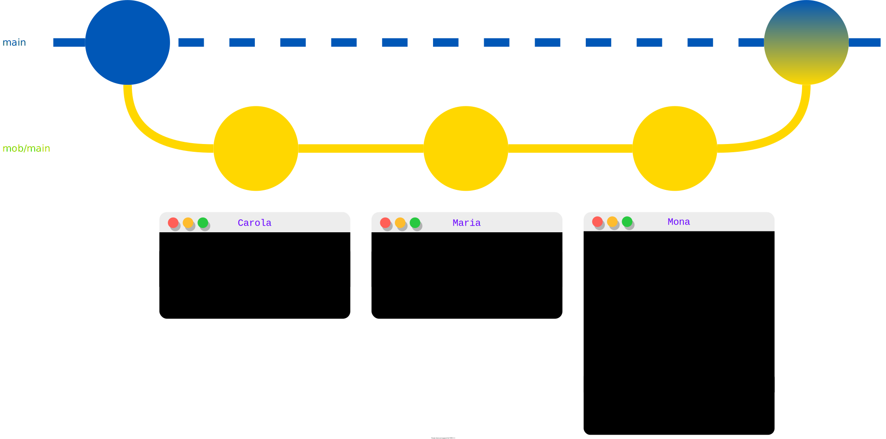

# Fast git handover with mob


<p align="center">
  <a href="https://github.com/remotemobprogramming/mob/actions?query=workflow%3ATest">
    </a>
  <a href="https://github.com/remotemobprogramming/mob/graphs/contributors">
    </a>
  <a href="https://github.com/remotemobprogramming/mob/releases">
    </a>
  <a href="https://github.com/remotemobprogramming/mob/releases">
    </a>
  <a href="https://img.shields.io/github/stars/remotemobprogramming/mob">
    </a>
</p>

**#StandWithUkraine [donate here](https://www.savethechildren.org.uk/where-we-work/europe/ukraine) #StandWithUkraine**

Fast [git handover](https://www.remotemobprogramming.org/#git-handover) for remote pair/mob programming.

- **mob** is [an open source command line tool written in go](https://github.com/remotemobprogramming/mob)
- **mob** is the fastest way to [hand over code via git](https://www.remotemobprogramming.org/#git-handover)
- **mob** keeps your branches clean and only creates WIP commits on temporary branches
- **mob** has a shared team timer [timer.mob.sh](https://timer.mob.sh)
- **mob** is on 'assess' in the [Thoughtworks Technology Radar](https://twitter.com/simonharrer/status/1453372354097205253?s=20)
- **mob** has [VSCode integration](https://marketplace.visualstudio.com/items?itemName=alessandrosangalli.mob-vscode-gui)



## What people say about mob

> Sometimes you come across a tool that you didn't realize you needed until you do; mob is just such a tool. Living as we do in a world where remote pair programming has become the norm for many teams, having a tool that allows for seamless handover either between pairs or a wider group as part of a mob programming session is super useful. mob hides all the version control paraphernalia behind a command-line interface that makes participating in mob programming sessions simpler. It also provides specific advice around how to participate remotely, for example, to "steal the screenshare" in Zoom rather than ending a screenshare, ensuring the video layout doesn't change for participants. A useful tool and thoughtful advice, what's not to like? &mdash; [Technology Radar
 Volume 25, thoughtworks](https://www.thoughtworks.com/radar/tools/mob)

> "Mob has allowed us to run fast-paced, engaging, and effective sessions by enabling sub-10-second handover times and otherwise getting out of the way. A simple but great tool!" &mdash; [Jeff Langr, developer](https://twitter.com/jlangr)

> "I love it, it is a quantum leap in our collaboration." &mdash; Vasiliy Sivovolov, Senior Software Engineer

>"What a great tool to organise remote working." &mdash; [Jennifer Gommans, IT Consultant](https://twitter.com/missjennbo)

> "I was recently introduced to [mob.sh](https://mob.sh) for remote pairing/mobbing collaboration and I absolutely love it. The timer feature is really a selling point for me. Kudos" &mdash; [Fabien Illert, IT Consultant](https://twitter.com/fabienillert)

## How to install

The recommended way to install mob is as a binary via the provided install script:

```bash
# works for macOS, linux, and even on windows in git bash
curl -sL install.mob.sh | sh
```

On macOS via homebrew:

```bash
brew install remotemobprogramming/brew/mob

# upgrade to latest version
brew upgrade remotemobprogramming/brew/mob
```

On Windows via [Scoop](https://scoop.sh/):

```bash
scoop install mob
```

or via [Chocolatey](https://chocolatey.org/)

```bash
choco install mob
```

On Arch Linux via yay:

```bash
yay -S mobsh-bin
```

On [Nix](http://nixos.org) through declarative installation

```nix
{ pkgs, ... }:
{
  # Either for all users
  environment.systemPackages = with pkgs; [ mob ];

  # Or for an explicit user
  users.users."youruser".packages = with pkgs; [ mob ];
}
```

On Ubuntu there's an EXPERIMENTAL [snap](https://snapcraft.io/mob-sh) package with a known limitation (ssh-agent not working):

```bash
sudo snap install mob-sh
sudo snap connect mob-sh:ssh-keys
```


### Using go tools

If you have go 1.16+ you can install and build directly from source:

```bash
go install github.com/remotemobprogramming/mob/v3@latest
```

or pick a specific version:

```bash
go install github.com/remotemobprogramming/mob/v3@v3.0.0
```

or to install latest unreleased changes:

```bash
go install github.com/remotemobprogramming/mob/v3@main
```

## How to use

You only need three commands: `mob start`, `mob next`, and `mob done`.

Switch to a separate branch with `mob start` and handover to the next person with `mob next`.
Repeat.
When you're done, get your changes into the staging area of the `main` branch with `mob done` and commit them.  

[](https://asciinema.org/a/321885)

Here's a short example on how the two developers Carola and Maria code a feature together and push it in the end.

```bash
# Carola
main $ mob start
mob/main $ echo "hello" > work.txt
mob/main $ mob next

# Maria
main $ mob start
mob/main $ cat work.txt # shows "hello"
mob/main $ echo " world" >> work.txt
mob/main $ mob next

# Carola
mob/main $ mob start
mob/main $ cat work.txt # shows "hello world"
mob/main $ echo "!" >> work.txt
mob/main $ mob done
main $ git commit -m "create greeting file"
main $ git push
```

And here's the man page of the tool:

```
mob enables a smooth Git handover

Basic Commands:
  start              start session from base branch in wip branch
  next               handover changes in wip branch to next person
  done               squashes all changes in wip branch to index in base branch
  reset              removes local and remote wip branch

Basic Commands(Options):
  start [<minutes>]                      Start a <minutes> timer
    [--include-uncommitted-changes|-i]   Move uncommitted changes to wip branch
    [--branch|-b <branch-postfix>]       Set wip branch to 'mob/<base-branch>-<branch-postfix>'
    [--create]                           Create the remote branch
  next
    [--stay|-s]                          Stay on wip branch (default)
    [--return-to-base-branch|-r]         Return to base branch
    [--message|-m <commit-message>]      Override commit message
  done
    [--no-squash]                        Squash no commits from wip branch, only merge wip branch
    [--squash]                           Squash all commits from wip branch
    [--squash-wip]                       Squash wip commits from wip branch, maintaining manual commits
  reset
    [--branch|-b <branch-postfix>]       Set wip branch to 'mob/<base-branch>/<branch-postfix>'
  clean                                  Removes all orphan wip branches

Timer Commands:
  timer <minutes>    start a <minutes> timer
  start <minutes>    start mob session in wip branch and a <minutes> timer
  break <minutes>    start a <minutes> break timer

Short Commands (Options and descriptions as above):
  s                  alias for 'start'
  n                  alias for 'next'
  d                  alias for 'done'
  b                  alias for 'branch'
  t                  alias for 'timer'

Get more information:
  status             show the status of the current session
  fetch              fetch remote state
  branch             show remote wip branches
  config             show all configuration options
  version            show the version
  help               show help

Other
  moo                moo!

Add --debug to any option to enable verbose logging


Examples:
  # start 10 min session in wip branch 'mob-session'
  mob start 10

  # start session in wip branch 'mob/<base-branch>/green'
  mob start --branch green

  # handover code and return to base branch
  mob next --return-to-base-branch

  # squashes all commits and puts changes in index of base branch
  mob done

  # make a sound check
  mob moo
```

If you need some assistance when typing the subcommands and options, you might want to have a look at [fig](https://fig.io/) which gives you autocompletion in your shell.

## Best Practices

- **Say out loud**
  - Whenever you key in `mob next` at the end of your turn or `mob start` at the beginning of your turn say the command out loud.
  - *Why?* Everybody sees and also hears whose turn is ending and whose turn has started. But even more important, the person whose turn is about to start needs to know when the previous person entered `mob next` so they get the latest commit via their `mob start`.
- **Steal the screenshare**
  - After your turn, don't disable the screenshare. Let the next person steal the screenshare. (Requires a setting in Zoom)
  - *Why?* This provides more calm (and less diversion) for the rest of the mob as the video conference layout doesn't change, allowing the rest of the mob to keep discussing the problem and finding the best solution, even during a Git handover.
- **Share audio**
  - Share your audio when you share your screen.
  - *Why?* Sharing audio means everybody will hear when the timer is up. So everybody will help you to rotate, even if you have missed it coincidentally or deliberately.
- **Use a timer**
  - Always specify a timer when using `mob start` (for a 5 minute timer use `mob start 5`)
  - *Why?* Rotation is key to good pair and mob programming. Just build the habit right from the start. Try to set a timer so everybody can have a turn at least once every 30 minutes.
- **Set up a global shortcut for screensharing**
  - Set up a global keyboard shortcut to start sharing your screen. In Zoom, you can do this via Zoom > Preferences > Keyboard Shortcuts. [More tips on setting up Zoom for effective screen sharing.](https://effectivehomeoffice.com/setup-zoom-for-effective-screen-sharing/)
  - *Why?* This is just much faster than using the mouse.
- **Set your editor to autosave**
  - Have your editor save your files on every keystroke automatically. IntelliJ products do this automatically. VS Code, however, needs to be configured via "File > Auto Save toggle".
  - *Why?* Sometimes people forget to save their files. With autosave, any change will be handed over via `mob next`.

### The Perfect Git Handover

The perfect git handover is quick, requires no talking, and allows the rest of the team to continue discussing how to best solve the current problem undisturbed by the handover. Here's how to achieve that.

- **Situation** Maria is typist sharing the screen, Mona is next
- **Maria** runs `mob next`
  - keeps sharing the screen with the terminal showing the successful run of `mob next`
  - does nothing (i.e., no typing, no mouse cursor movement, no window switching)
- **Mona** steals screenshare using keyboard shortcut, and, afterwards, runs `mob start`
- **Maria** checks her twitter

### Complementary Scripts

`mob-start feature1` creates a new base branch `feature1` to immediately start a wip branch `mob/feature1` from there.

```bash
mob-start() { git checkout -b "$@" && git push origin "$@" --set-upstream && mob start --include-uncommitted-changes; }
```

### Useful Aliases

```bash
alias ms='mob start'
alias mn='mob next'
alias md='mob done'
alias moo='mob moo'
```

### Use the name you like

```bash
mob version
#v1.11.0
alias ensemble='mob' # introduce alias
export MOB_CLI_NAME='ensemble' # makes it aware of the alias
ensemble next
#👉 to start working together, use
#
#  ensemble start
#
```

And starting with v1.12.0, `mob` is symlink aware as well:

```bash
mob version
#v1.12.0
ln -s /usr/local/bin/mob /usr/local/bin/ensemble
ensemble next
#👉 to start working together, use
#
#  ensemble start
#
```

### Automatically set the timer room when using ticket numbers as branch modifiers

Say you're a larger team and work on the same git repository using ticket numbers as branch modifiers.
It's easy to forget exporting the room that enables the integration with timer.mob.sh.
Just set the configuration option `MOB_TIMER_ROOM_USE_WIP_BRANCH_QUALIFIER=true` in `~/.mob` for that.

### Automatically open the last modified file of the previous typist

When you are rotating the typist, you often need to open the file, which the previous typist has modified last.
Mob supports you and can automate this step. You just need the configuration option `MOB_OPEN_COMMAND` with the command to open a file in your preferred IDE. 

For example if you want use IntelliJ the configuration option would look like this: `MOB_OPEN_COMMAND=idea %s`

## More on Installation

### Known Issues

- When you have an ssh key with a password and you running mob on windows in powershell, you will not be able to enter a password for your ssh key. You can circumvent this problem by using the git bash instead of powershell.

### Linux Timer

(This is not needed when installing via snap.)

To get the timer to play "mob next" on your speakers when your time is up, you'll need an installed speech engine.
Install that on Debian/Ubuntu/Mint as follows:

```bash
sudo apt-get install espeak-ng-espeak mbrola-us1
```

or on Arch Linux as follows:
```bash
sudo pacman -S espeak-ng-espeak
yay -S mbrola-voices-us1
```

Create a little script in your `$PATH` called `say` with the following content:

```bash
#!/bin/sh
espeak -v us-mbrola-1 "$@"
```

If you use WSL2 on windows, install eSpeak as windows tool and Create a little script in your `$PATH` called `say` with the following content:

```bash
#!/bin/sh
/mnt/c/Program\ Files\ \(x86\)/eSpeak/command_line/espeak.exe "$@"
```

make sure that the path to the windows `espeak.exe`fits your installation.
You can avoid the long path by adding it to your windows path variable.

## How to configure

Show your current configuration with `mob config`:

```toml
MOB_CLI_NAME="mob"
MOB_REMOTE_NAME="origin"
MOB_WIP_COMMIT_MESSAGE="mob next [ci-skip] [ci skip] [skip ci]"
MOB_START_COMMIT_MESSAGE="mob start [ci-skip] [ci skip] [skip ci]"
MOB_GIT_HOOKS_ENABLED=false
MOB_REQUIRE_COMMIT_MESSAGE=false
MOB_VOICE_COMMAND="say \"%s\""
MOB_VOICE_MESSAGE="mob next"
MOB_NOTIFY_COMMAND="/usr/bin/osascript -e 'display notification \"%s\"'"
MOB_NOTIFY_MESSAGE="mob next"
MOB_NEXT_STAY=true
MOB_START_CREATE=false
MOB_STASH_NAME="mob-stash-name"
MOB_WIP_BRANCH_QUALIFIER=""
MOB_WIP_BRANCH_QUALIFIER_SEPARATOR="-"
MOB_WIP_BRANCH_PREFIX="mob/"
MOB_DONE_SQUASH=squash
MOB_OPEN_COMMAND="idea %s"
MOB_TIMER=""
MOB_TIMER_ROOM="mob"
MOB_TIMER_ROOM_USE_WIP_BRANCH_QUALIFIER=false
MOB_TIMER_LOCAL=true
MOB_TIMER_USER="sh"
MOB_TIMER_URL="https://timer.mob.sh/"
```

Override default value permanently via a `.mob` file in your user home or in your git project repository root. (recommended)

Override default value permanently via environment variables:

```bash
export MOB_NEXT_STAY=true
```

Override default value just for a single call:

```bash
MOB_NEXT_STAY=true mob next
```

### Integration with timer.mob.sh
For your name to show up in the room at timer.mob.sh you must set a timer value either via the `MOB_TIMER` variable, a config file, or an argument to `start`.

## How to uninstall
Mob can simply be uninstalled by removing the installed binary (at least if it was installed via the http://install.mob.sh script). 

### Linux
    rm /usr/local/bin/mob
### Windows (Git Bash)
    rm ~/bin/mob.exe
### MacOS
    brew uninstall remotemobprogramming/brew/mob

## How to contribute

[Propose your change in an issue](https://github.com/remotemobprogramming/mob/issues) or [directly create a pull request with your improvements](https://github.com/remotemobprogramming/mob/pulls).

```bash
# PROJECT_ROOT is the root of the project/repository

cd $PROJECT_ROOT

git version # >= 2.17
go version # >= 1.15

go build # builds 'mob'

go test # runs all tests
go test -run TestDetermineBranches # runs the single test named 'TestDetermineBranches'

# run tests and show test coverage in browser
go test -coverprofile=cover.out && go tool cover -html=cover.out
```

## Design Concepts

- **mob** is a thin wrapper around git.
- **mob** is not interactive.
- **mob** owns its wip branches. It will create wip branches, make commits, push them, but also delete them.
- **mob** requires the user to do changes in non-wip branches.
- **mob** provides a copy'n'paste solution if it encounters an error.
- **mob** relies on information accessible via git.
- **mob** provides only a few environment variables for configuration.
- **mob** only uses the Go standard library and no 3rd party plugins.

## Who is using 'mob'?

- [INNOQ](https://www.innoq.com)
- [BLUME2000](https://twitter.com/slashBene/status/1337329356637687811?s=20)
- [REWE Digital](https://www.rewe-digital.com/)
- [Amadeus IT Group](https://amadeus.com/)
- And probably many others who shall not be named.

## Credits

Created by [Dr. Simon Harrer](https://twitter.com/simonharrer) in September 2018.

Currently maintained by [Gregor Riegler](https://twitter.com/gregor_riegler) and [Joshua Töpfer](https://twitter.com/JoshuaToepfer), and to some limited degree still by [Dr. Simon Harrer](https://twitter.com/simonharrer).

Contributions and testing by Jochen Christ, Martin Huber, Franziska Dessart, Nikolas Hermann
and Christoph Welcz. Thank you!

Logo designed by [Sonja Scheungrab](https://twitter.com/multebaerr).

<a href="https://github.com/remotemobprogramming/mob/" class="github-corner" aria-label="View source on GitHub"><svg width="80" height="80" viewBox="0 0 250 250" style="fill:#151513; color:#fff; position: absolute; top: 0; border: 0; right: 0;" aria-hidden="true"><path d="M0,0 L115,115 L130,115 L142,142 L250,250 L250,0 Z"></path><path d="M128.3,109.0 C113.8,99.7 119.0,89.6 119.0,89.6 C122.0,82.7 120.5,78.6 120.5,78.6 C119.2,72.0 123.4,76.3 123.4,76.3 C127.3,80.9 125.5,87.3 125.5,87.3 C122.9,97.6 130.6,101.9 134.4,103.2" fill="currentColor" style="transform-origin: 130px 106px;" class="octo-arm"></path><path d="M115.0,115.0 C114.9,115.1 118.7,116.5 119.8,115.4 L133.7,101.6 C136.9,99.2 139.9,98.4 142.2,98.6 C133.8,88.0 127.5,74.4 143.8,58.0 C148.5,53.4 154.0,51.2 159.7,51.0 C160.3,49.4 163.2,43.6 171.4,40.1 C171.4,40.1 176.1,42.5 178.8,56.2 C183.1,58.6 187.2,61.8 190.9,65.4 C194.5,69.0 197.7,73.2 200.1,77.6 C213.8,80.2 216.3,84.9 216.3,84.9 C212.7,93.1 206.9,96.0 205.4,96.6 C205.1,102.4 203.0,107.8 198.3,112.5 C181.9,128.9 168.3,122.5 157.7,114.1 C157.9,116.9 156.7,120.9 152.7,124.9 L141.0,136.5 C139.8,137.7 141.6,141.9 141.8,141.8 Z" fill="currentColor" class="octo-body"></path></svg></a>
